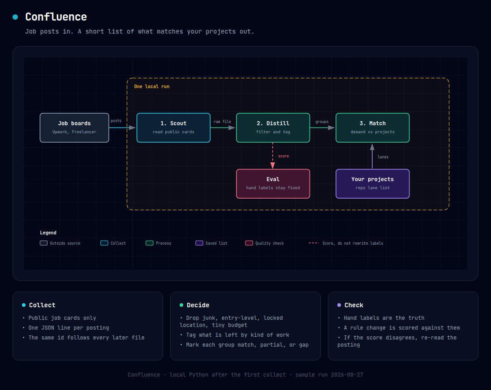

# Confluence

Match freelance demand to the projects you already have.

It reads public job posts, drops the ones that do not fit, groups what is left, and compares those groups to your repository list. Every step writes a file you can open. A small set of hand labels tells you whether a rule change helped.



The same picture, open in a browser: [docs/architecture.html](docs/architecture.html)

## The four steps

1. **Scout** reads public job cards and writes one line per posting.
2. **Distill** drops junk, entry-level, location-locked, and tiny-budget posts. It tags the rest by kind of work.
3. **Match** compares each demand group to your project list and marks it `match`, `partial`, or `gap`.
4. **Eval** scores that run against hand labels. Do not edit the labels to make the score look better.

Steps 2–4 are plain Python. You can re-run them on any saved run. Step 1 needs a browser. The extract recipe is in `pipeline/scout.py`. Running that file alone only checks that the raw file is already there.

## Try the sample run

```bash
python pipeline/distill.py --run runs/20260827
python pipeline/match.py --run runs/20260827 --snapshot state/github_snapshot.jsonl
python pipeline/run_evals.py --run runs/20260827
```

That sample is one day, not a benchmark:

```text
raw posts        182
kept             171
dropped           11
demand groups     10
match rows        10
```

Dropped posts keep a reason: `entry_level`, `geo_locked`, `micro_budget`, or `title_junk`.

## Look at one posting

Every record keeps the same `id` from the first file to the last.

```python
import pandas as pd

kept = pd.read_json("runs/20260827/stage2_distill/viable.jsonl", lines=True)
kept["lanes"].explode().value_counts()

dropped = pd.read_json("runs/20260827/stage2_distill/rejected.jsonl", lines=True)
dropped["rejection_reasons"].explode().value_counts()
```

`runs/<id>/manifest.json` records how many records each step read and wrote, and how long it took.

## Add labels

```bash
python pipeline/label.py --run runs/<id> --sample 10
python pipeline/label.py --id <id> --outcome viable --lanes python-automation
python pipeline/label.py --id <id> --outcome rejected --reasons entry_level
python pipeline/run_evals.py --run runs/<id>
```

Gold labels are append-only. If the report disagrees with a label, check the posting before changing the rule.

One real miss this caught: Upwork prints experience as `Entry | Experience level`, not `entry-level`. The first filter pass missed those cards. The gold set now pins those cases so the miss comes back if the rule breaks.

## Layout

```text
pipeline/          scout, distill, match, label, eval
runs/<id>/         one folder per collect
state/             the project list used by match
evals/gold/        hand labels
evals/reports/     scores for each run
docs/              architecture picture
```

## What this is not

- Not a language model. Filtering and tagging are keyword rules.
- Not semantic search. Match uses a hand-written lane list for repositories. The snapshot file is loaded, but a repo description alone does not assign the lane.
- Not a quality score you can quote yet. The included eval has four rejection labels and no lane labels. A perfect rejection score on four rows is not a general result.
